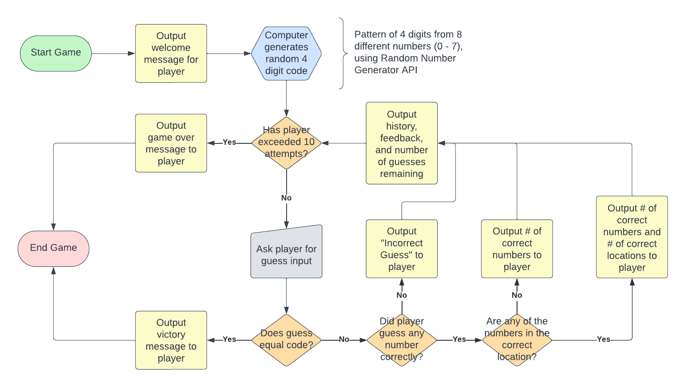
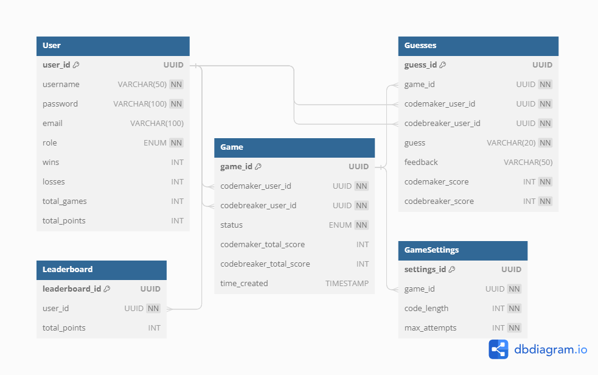

# <a name="summary"></a> Mastermind Game

This is a backend-focused version of the classic Mastermind game.

</br>

**Table Of Contents**

- [Summary](#summary)
- [Tech Stack](#tech-stack)
- [Features](#features)
- [Installation](#installation)
- [Devlog](#devlog)
- [About Me](#about-me)

## <a name="tech-stack"></a>Tech Stack

**Frontend:** HTML5, CSS, Javascript <br/>
**Backend:** Python, Flask, Flask-SocketIO, PostgreSQL, SQLAlchemy <br/>
**APIs:** Random.org <br/>

## <a name="features"></a> Features

Users can play against a "computer" opponent in singleplayer mode with real-time feedback:


Two users can start a game against each other in multiplayer mode via WebSocket. The host will automatically serve as the `codemaker` while the other player will serve as the `codebreaker`. Players can provide real-time guesses and feedback until the game is finished and can also interact via the in-game chat:


Up to 6 users can join a battle royale mode. The game will generate the secret code and all the players will receive real-time private feedback for their own guesses until someone wins by correctly guessing the code. Players can also interact via the chat interface where game state updates are automatically provided as well:


## <a name="installation"></a> Installation

#### Requirements:

- PostgreSQL
- Python 3.7.3

Follow the following steps to run on your local computer:

Clone repository:

```
$ git clone https://github.com/franciscobortega/mastermind.git
```

Create and activate a virtual environment:

```
$ pip3 install virtualenv
$ virtualenv env
$ source env/bin/activate
```

Install dependencies:

```
(env) $ pip3 install -r requirements.txt
```

Run the database seeding script:

```
(env) $ python3 seed.py
```

Start the backend server:

```
(env) $ python3 app.py
```

Navigate to `localhost:5000` in your browser to see the web app

## <a name="devlog"></a> Devlog

### Day 1

I started Day 1 by reviewing the requirements and getting familiar with the Mastermind game. I spent some time familiarizing myself with the game via game/rule walkthroughs and by playing several rounds of the game itself. Once I understood the gameplay, I established a plan of action given the limited time for the project. I identified key goals and technologies needed for the MVP and established some additional enhancements I was interested in implementing within the scope of the provided time.

I designed the following user flow diagram to ensure that I had a thorough understanding of the core game logic and that any future enhancements would not deviate from the expected behavior of the game:



I finished Day 1 by simply setting up my coding environment and completing a console-based version of Mastermind to validate my understanding of the core game logic.

### Day 2

The majority of Day 2 was spent implementing Mastermind as a Flask application. The UI is simple HTML and is unlikely to become anything remarkable. I focused on making the MVP a single-player game with sufficient input validation, guess evaluation, and feedback to relay the experience of playing Mastermind regardless of the lack of UI design elements. I made minimal adjustments to the core game logic in this implementation. Although the game functioned as expected, the need to implement testing as the project became more complex was evident.

I finished Day 2 by designing the following data model for the backend within the context of the existing single player solution and reasonably considered enhancements I wanted for the final product:



### Day 3

I spent most of Day 3 researching how to host real-time communication between players and eventually settled on Flask-SocketIO due to its simplicity and flexibility within the context of my Flask application. I was able to create a simple chat interface that taught me how WebSocket communication works. The next step was to determine what extensions for the project I wanted to work on. The most obvious choice was a 1v1 multiplayer game mode but I was also interested in a "Battle Royale" type of mode.

I laid out the templates and routes necessary for a lobby and multiplayer game. I started the process of redirecting players from the lobby room to the game room with their assigned roles of codemaker and codebreaker.

### Day 4 and 5

Unfortunately, I was unable to work on this project during these two days due to some personal obligations.

### Day 6

The majority of Day 6 was spent trying to set up the redirection for players in the lobby to the game endpoint. Although the players correctly ended up in the correct room, on the backend the player and session data was not being updated properly in some areas. Ultimately, I decided to implement a single page approach that would not require an explicit redirection.

The event handling between the clients and server was much smoother and by the end of the day I had a functional multiplayer game where the players could join a game via a game code and communicate using a chat interface. The player assigned `codemaker` could intially set the secret code, the player assigned `codebreaker` would then be able to provide a guess, and then have the `codemaker` provide feedback. These interactions with the WebSocket connection would also be transmitted in the chat from the server.

This game mode has no computer validation for feedback to imitate the real Mastermind game, where the codebreaker at the end can then challenge any feedback they have received. Styling was applied to the UI to help players navigate around the game interface.

### Day 7

## <a name="about-me"></a> About me

This was a take-home assignment. Connect with me on [LinkedIn](http://www.linkedin.com/in/bryanortega/)!
