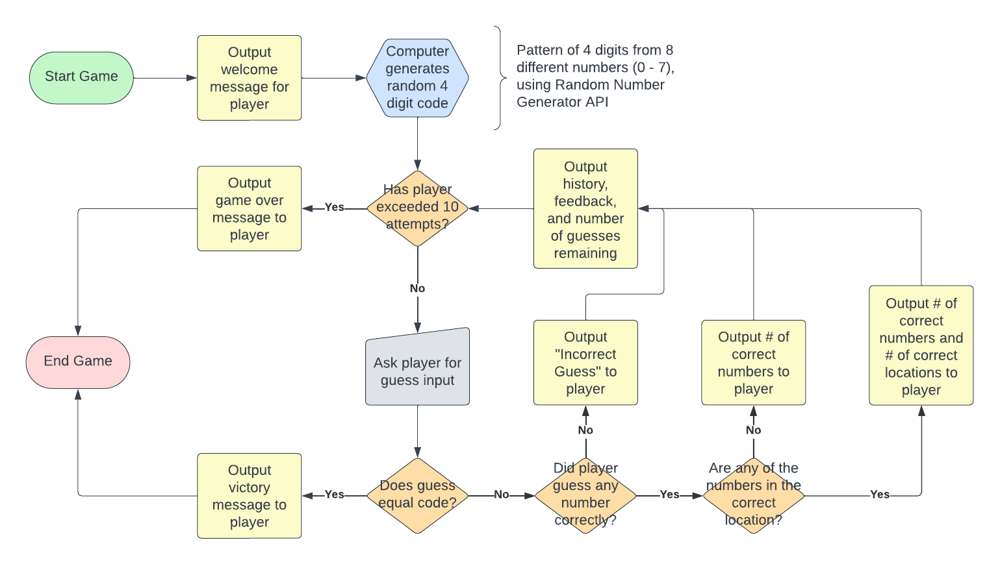
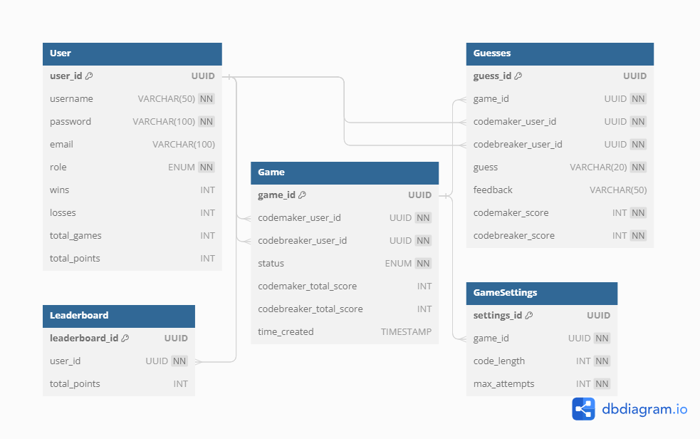

# Mastermind Game

## Day 1

I started Day 1 by reviewing the requirements and getting familiar with the Mastermind game. I spent some time familiarizing myself with the game via game/rule walkthroughs and by playing several rounds of the game itself. Once I understood the gameplay, I established a plan of action given the limited time for the project. I identified key goals and technologies needed for the MVP and established some additional enhancements I was interested in implementing within the scope of the provided time.

I designed the following user flow diagram to ensure that I had a thorough understanding of the core game logic and that any future enhancements would not deviate from the expected behavior of the game:

I finished Day 1 by simply setting up my coding environment and completing a console-based version of Mastermind to validate my understanding of the core game logic.

## Day 2

The majority of Day 2 was spent implementing Mastermind as a Flask application. The UI is simple HTML and is unlikely to become anything remarkable. I focused on making the MVP a single-player game with sufficient input validation, guess evaluation, and feedback to relay the experience of playing Mastermind regardless of the lack of UI design elements. I made minimal adjustments to the core game logic in this implementation. Although the game functioned as expected, the need to implement testing as the project became more complex was evident.

I finished Day 2 by designing the following data model for the backend within the context of the existing single player solution and reasonably considered enhancements I wanted for the final product:

## Day 3

## Day 4

## Day 5

## Day 6

## Day 7
